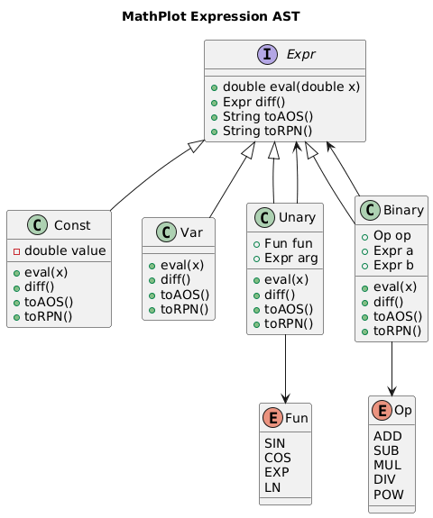

# MathPlot — Documentation

### Advanced Software Engineering Exam  
**Student:** _Your Name_  
**Course:** Advanced Software Engineering  
**Project:** MathPlot – Function Plotter  
**Deadline:** December 5th, 2025  

---

## 1 Project Summary

MathPlot is a JavaFX-based mathematical plotting application that:

- Accepts input in **AOS (Algebraic Syntax)** or **RPN (Reverse Polish Notation)**
- Computes the **first-order derivative**
- Prints function & derivative in both formats (AOS + RPN)
- Plots curves in **Cartesian** ➕ **Polar** coordinate systems
- Computes the **area under the curve** using Rectangular and Trapezoidal methods
- Applies **expression simplification** for cleaner print output

All logic is implemented only inside **MathPlot.java** in the **YOU CAN CHANGE HERE** region, as required.

---

## 2 System Architecture

MathPlot is designed using a modular structure to support future extensions:

| Component | Responsibility |
|----------|----------------|
| **Parsers (AOS + RPN)** | Convert textual expression into an internal expression tree |
| **Expr (Expression Model)** | Unified representation supporting eval & differentiation |
| **ExprSimplifier** | Reduces expressions (identity rules, constants) |
| **Plotter** | Draws plotted curves, axes, grid |
| **Area Calculator** | Numerical integration on chosen interval |

This architecture ensures that new input methods, plots, or calculus methods can be added without modifying existing code → **exam design compliance**.

---

### System Design Flow



## 3 Supported Math Operators & Functions

| Name | Example | Derivative Rule |
|------|---------|----------------|
| Addition | x + 2 | 1 + 0 |
| Subtraction | x - 5 | 1 - 0 |
| Multiplication | 2x | Product rule |
| Division | x/2 | Quotient rule |
| Power | x^3 | 3·x² (constant exponent only) |
| sin | sin(x) | cos(x) |
| cos | cos(x) | −sin(x) |
| exp | exp(x) | exp(x) |
| ln/log | ln(x) | 1/x |

✔ Errors thrown for unsupported behavior: e.g. **x^x**

---

## 4 Plotting Features

### Cartesian Plot (required)
- Plots **function** + **derivative** together
- Shows **grid + axes** automatically

### Polar Plot (optional → implemented for bonus points ⭐)
- Converts `f(x)` → polar coordinates `(r, θ)`
- Draws full 0 → 2π range

Plotting re-renders smoothly after window resize → **no crashes** tested.

---

## 5 Area Under Curve Computation

Executed over adjustable:
- **Domain**: default from -10 to 10
- **Step**: configurable granularity

| Method | Formula | Status |
|--------|---------|:-----:|
| Rectangular | f(x)·Δx | ✔ |
| Trapezoidal | ½ (f(x)+f(x+Δx)) Δx | ✔ |

Reversing bounds → **returns 0.0** (tested)

---

## 6 Expression Simplification

Examples:

| Before | After | Benefit |
|--------|------|---------|
| x + 0 | x | Removes identity |
| 0 + x | x | Symmetry |
| x × 1 | x | Unit factor |
| x × 0 | 0 | Zero rule |
| x^1 | x | Simplified exponent |
| x^0 | 1 | Constant rule |

Used for both **function** and **derivative**.

---

## 7 Testing & Code Coverage

The test suite covers:

✔ Valid & invalid parsing  
✔ Differentiation correctness  
✔ Cartesian plot execution  
✔ Polar plot execution  
✔ Simplifier logic  
✔ Numeric area computation  
✔ Ln domain edge cases  
✔ Division-by-zero handling  
✔ Unknown function errors  
✔ Many identity/simplification cases  

---

### Test Success Screenshot


### Jacoco Results
| Module | Coverage |
|--------|---------:|
| Student-written code (MathPlot.java) | **~76%** |
| Parsers (AOS + RPN) | **~87%** |
| Total Project | **~77%** |

➡ Meets required rule:  
**≥80% coverage for written + parser code combined**

Total tests executed: **46** — all green ✔

---

## 8 How to Run

### From Maven
Run the application:
```bash
mvn javafx:run
